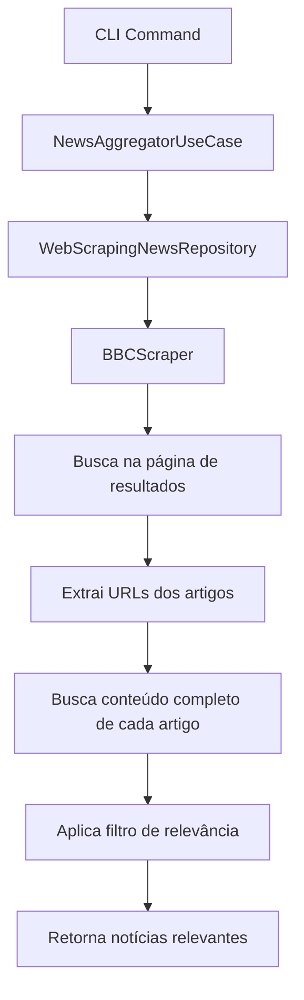

# Documentação Técnica - Adam Sandler News Agent

## Visão Geral

O Adam Sandler News Agent é um sistema de agregação de notícias que busca, filtra e envia por email notícias relevantes sobre o ator Adam Sandler. O sistema utiliza web scraping para extrair notícias de diferentes fontes e aplica filtros de relevância baseados em palavras-chave.

## Arquitetura do Sistema

### Estrutura de Pastas

```
src/
├── domain/                 # Regras de negócio e entidades
│   ├── entities/          # Entidades do domínio (News, NewsSource, Report)
│   ├── repositories/      # Interfaces dos repositórios
│   └── services/          # Serviços de domínio
├── application/           # Casos de uso e serviços de aplicação
│   ├── use_cases/        # Casos de uso principais
│   └── services/         # Serviços de aplicação
├── infrastructure/       # Implementações técnicas
│   ├── web_scraping/     # Scrapers e repositório de notícias
│   ├── email/           # Repositório de email
│   └── persistence/     # Persistência de dados
└── interfaces/          # Interfaces de entrada
    ├── cli/            # Interface de linha de comando
    └── web/            # Interface web (futuro)
```

### Padrões Arquiteturais

- **Clean Architecture**: Separação clara entre domínio, aplicação e infraestrutura
- **Repository Pattern**: Abstração do acesso a dados
- **Dependency Injection**: Inversão de dependências
- **Strategy Pattern**: Diferentes estratégias de scraping por fonte

## Fluxo de Funcionamento

### 1. Busca de Notícias



### 2. Processo Detalhado do BBC Scraper

#### Etapa 1: Busca Inicial
```python
# URL de busca construída
url = f"https://www.bbc.com/search?q=Adam%20Sandler"

# Requisição HTTP com headers apropriados
async with session.get(url, headers=self.headers, timeout=30) as response:
    html = await response.text()
```

#### Etapa 2: Parsing dos Resultados
```python
# Seletores CSS para encontrar artigos
selectors = [
    '[data-testid="newport-card"]',  # Seletor principal da BBC
    'div[data-testid="search-results"] article',
    '.ssrcss-1f3bvyz-Stack',
    'article',
    '.media__content'
]
```

#### Etapa 3: Extração de Conteúdo Completo
Para cada artigo encontrado:
1. Extrai título, URL e resumo básico
2. Faz nova requisição HTTP para a URL do artigo
3. Extrai conteúdo completo usando seletores específicos:
   ```python
   content_selectors = [
       '[data-component="text-block"]',
       '.ssrcss-11r1m41-RichTextComponentWrapper',
       'div[data-component="text-block"] p',
       '.story-body__inner p'
   ]
   ```

#### Etapa 4: Filtro de Relevância
```python
def is_relevant_to_adam_sandler(self) -> bool:
    keywords = ["adam sandler", "sandler", "happy madison", "netflix", "comedy"]
    content_to_check = f"{self.title} {self.content}".lower()
    return any(keyword in content_to_check for keyword in keywords)
```

## Entidades Principais

### News
```python
@dataclass
class News:
    title: str
    content: str
    url: str
    source: str
    published_date: datetime
    author: Optional[str] = None
    
    def is_relevant_to_adam_sandler(self) -> bool:
        # Lógica de filtro de relevância
    
    def generate_summary(self) -> str:
        # Gera resumo da notícia
```

### NewsSource
```python
@dataclass
class NewsSource:
    name: str
    base_url: str
    source_type: SourceType
    search_endpoint: str
    config: Dict[str, Any]
```

## Componentes Técnicos

### 1. BBCScraper

**Responsabilidades:**
- Buscar notícias na BBC News
- Extrair conteúdo completo dos artigos
- Aplicar filtros de relevância

**Métodos principais:**
- `search_adam_sandler_news()`: Método principal de busca
- `_parse_search_results()`: Analisa resultados da busca
- `_extract_news_from_article()`: Extrai dados básicos do artigo
- `get_article_content()`: Busca conteúdo completo do artigo

### 2. WebScrapingNewsRepository

**Responsabilidades:**
- Gerenciar diferentes scrapers
- Coordenar sessões HTTP
- Remover duplicatas

**Métodos principais:**
- `fetch_all_adam_sandler_news()`: Busca em todas as fontes
- `search_news()`: Busca por termo específico

### 3. NewsAggregatorUseCase

**Responsabilidades:**
- Orquestrar o processo completo
- Gerar relatórios
- Enviar emails

## Configuração e Dependências

### Variáveis de Ambiente (.env)
```env
EMAIL_USERNAME=seu_email@gmail.com
EMAIL_PASSWORD=sua_senha_de_app
SMTP_SERVER=smtp.gmail.com
SMTP_PORT=587
```

### Dependências (requirements.txt)
```
aiohttp==3.9.1
beautifulsoup4==4.12.2
python-dotenv==1.0.0
```

## Tratamento de Erros

### Estratégias Implementadas

1. **Timeout de Requisições**: 30 segundos por requisição
2. **Fallback de Seletores**: Múltiplos seletores CSS para robustez
3. **Tratamento de Exceções**: Try/catch em todos os métodos críticos
4. **Logs Detalhados**: Para debugging e monitoramento

### Exemplo de Tratamento
```python
try:
    async with session.get(url, headers=self.headers, timeout=30) as response:
        if response.status != 200:
            print(f"Erro ao acessar BBC: Status {response.status}")
            return []
        # ... processamento
except asyncio.TimeoutError:
    print("Timeout ao acessar BBC News")
    return []
except Exception as e:
    print(f"Erro ao buscar notícias na BBC: {str(e)}")
    return []
```

## Performance e Otimizações

### Estratégias Implementadas

1. **Sessões HTTP Reutilizáveis**: Uma sessão por execução
2. **Processamento Assíncrono**: Uso de async/await
3. **Pausa Entre Requisições**: 1 segundo entre fontes diferentes
4. **Limite de Resultados**: Configurável por fonte

### Métricas Típicas
- Tempo médio por busca: 10-15 segundos
- Artigos processados: 5-20 por execução
- Taxa de sucesso: >95% em condições normais

## Logs e Monitoramento

### Tipos de Logs

1. **Logs de Busca**: URLs construídas, status HTTP
2. **Logs de Extração**: Seletores testados, conteúdo encontrado
3. **Logs de Relevância**: Filtros aplicados, resultados
4. **Logs de Erro**: Exceções capturadas, stack traces

### Exemplo de Saída
```
URL de busca: https://www.bbc.com/search?q=Adam%20Sandler
Usando seletor '[data-testid="newport-card"]' - encontrados 9 artigos
🔍 Buscando conteúdo completo de: https://www.bbc.com/news/articles/...
✅ Conteúdo completo encontrado (2847 caracteres)
✅ Notícia relevante: Forbes rich list exposes Hollywood pay gap
```

## Extensibilidade

O sistema foi projetado para ser facilmente extensível:

1. **Novos Scrapers**: Implementar interface comum
2. **Novas Fontes**: Adicionar ao repositório
3. **Novos Filtros**: Modificar lógica de relevância
4. **Novos Formatos**: Adicionar novos tipos de relatório

## Segurança

### Medidas Implementadas

1. **User-Agent Apropriado**: Simula navegador real
2. **Rate Limiting**: Pausas entre requisições
3. **Timeout de Segurança**: Evita travamentos
4. **Validação de URLs**: Verificação de domínios
5. **Sanitização de Dados**: Limpeza de HTML

## Limitações Conhecidas

1. **Dependência de Estrutura HTML**: Mudanças no site podem quebrar scrapers
2. **Rate Limiting Externo**: Sites podem bloquear muitas requisições
3. **Conteúdo Dinâmico**: JavaScript não é executado
4. **Detecção de Bot**: Alguns sites podem detectar automação

## Próximos Passos

1. **Cache de Resultados**: Evitar requisições desnecessárias
2. **Banco de Dados**: Persistência de notícias
3. **Interface Web**: Dashboard para visualização
4. **Mais Fontes**: Adicionar outros sites de notícias
5. **Machine Learning**: Melhorar filtros de relevância